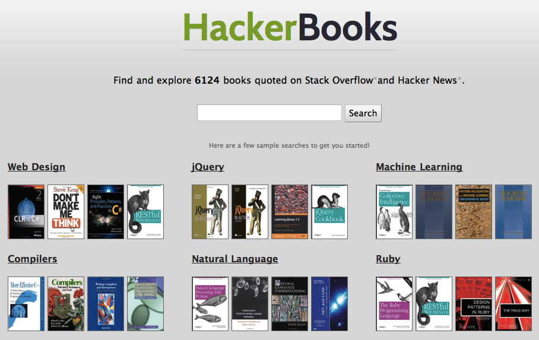

!SLIDE

# MongoDB + Solr
## ETL et indexation full-text

 
 
 
<h3>Retour d'expérience sur HackerBooks.com</h3>
<h3>Thibaut Barrère @ LoGeek.fr</h3>

!SLIDE full-page-image

!SLIDE full-page-image

## Stack Overflow

!SLIDE full-page-image

## Hacker News

!SLIDE

<h1>Extract Transform Load</h1>

  

!SLIDE

### Friction lors d'un travail de type ETL

<h1>MongoDB est à SQL</h1>

<h2>ce que Ruby est à Java</h2>

!SLIDE

# Sources de données

## Dump Hacker News: 1 fichier - 1 Gb (XML)
## Crawler Hacker News: collection MongoDB
## Dump Stack Overflow: 2 fichiers - 3 Gb (XML)

!SLIDE

## Extraction/conformation

    @@@ruby
    HackerNews::SaxReader.new(file).each do |record|
      
      result = {}      
      
      result['discussion_id'] = record['ParentID']
      result['points'] = record['Points']
      # ...
      
      batch << result
      
      if batch.size > 1000
        collection.insert(batch, :safe => true)
        batch = []
      end
    end

!SLIDE

<h1>Indexation full-text</h1>

  

!SLIDE

## Définition des indexes

    @@@ruby
    Sunspot.setup(Book) do

      text :asin, :title, :description, :stored => true

      string :quoted_by, :multiple => true
      string :quoted_on, :multiple => true

      integer :karma
      boolean :kindle_edition

    end

!SLIDE

## Recherche simple

    @@@ruby
    Sunspot.search(Book) do
      keywords 'SQL', :fields => [:title, :description]
      
      order_by :score, :desc
      order_by :karma, :desc
    end

!SLIDE

## Recherche tunée

    @@@ruby
    Sunspot.search(Book) do
      keywords "SQL -Ruby" do
        boost_fields :title => 1.5, :description => 0.1
        boost(function { product(:karma, 3) }) 
      end
      
      with :quoted_on,'HN'
      with :kindle_edition,true
      
      paginate :page => 3, :per_page => 10
    end
