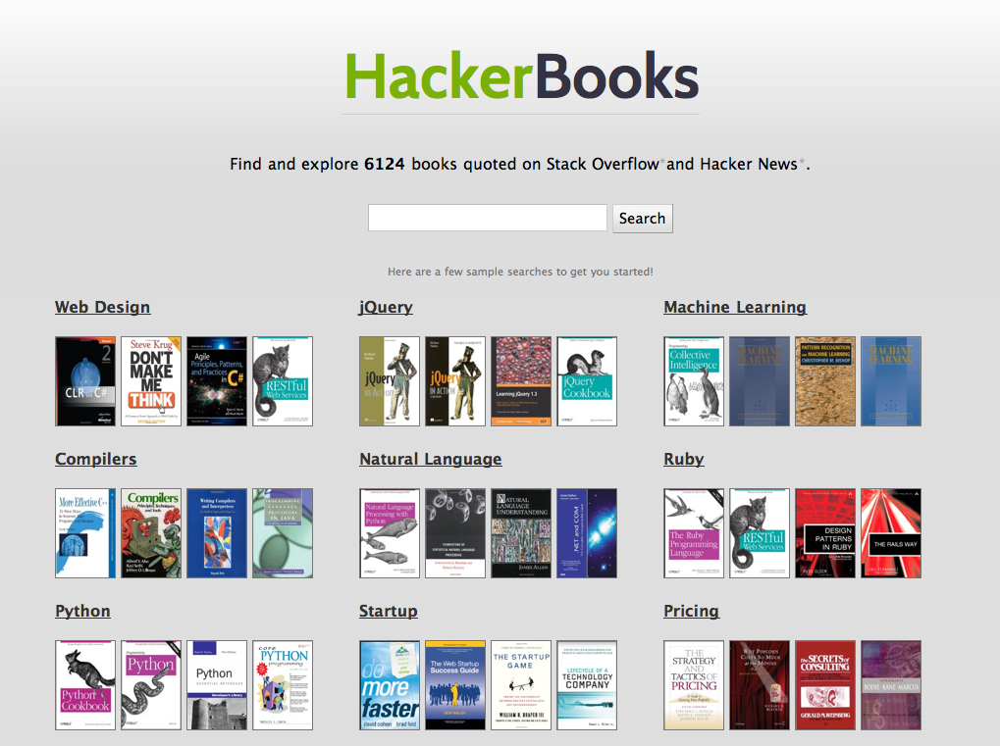
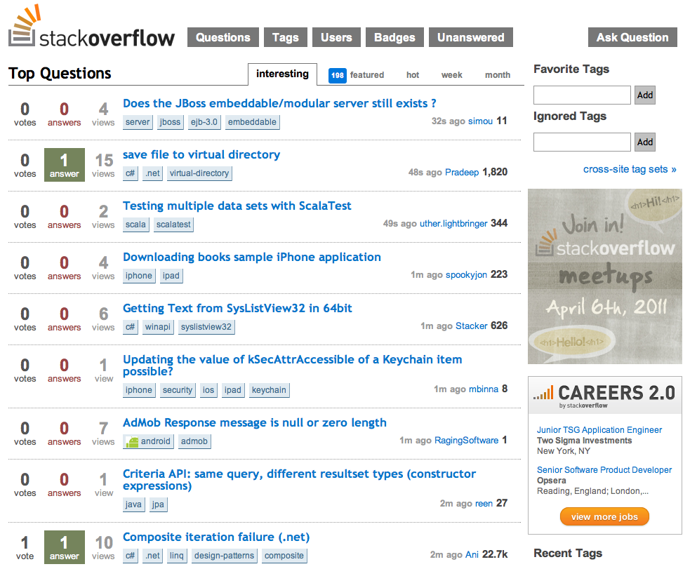
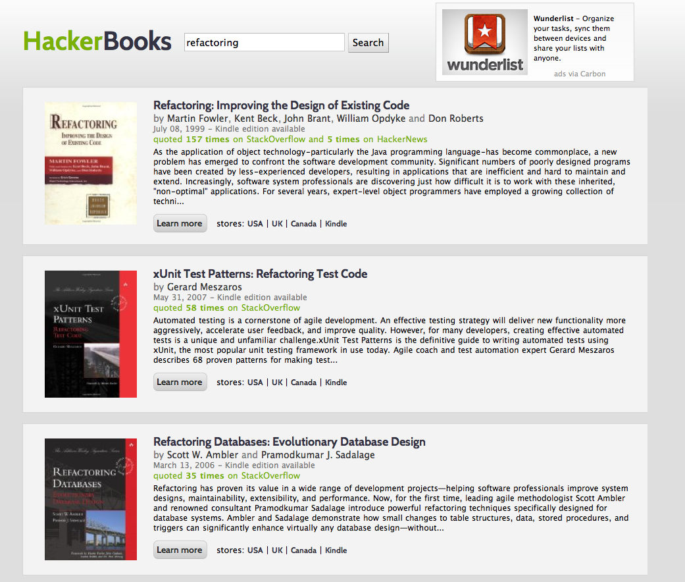
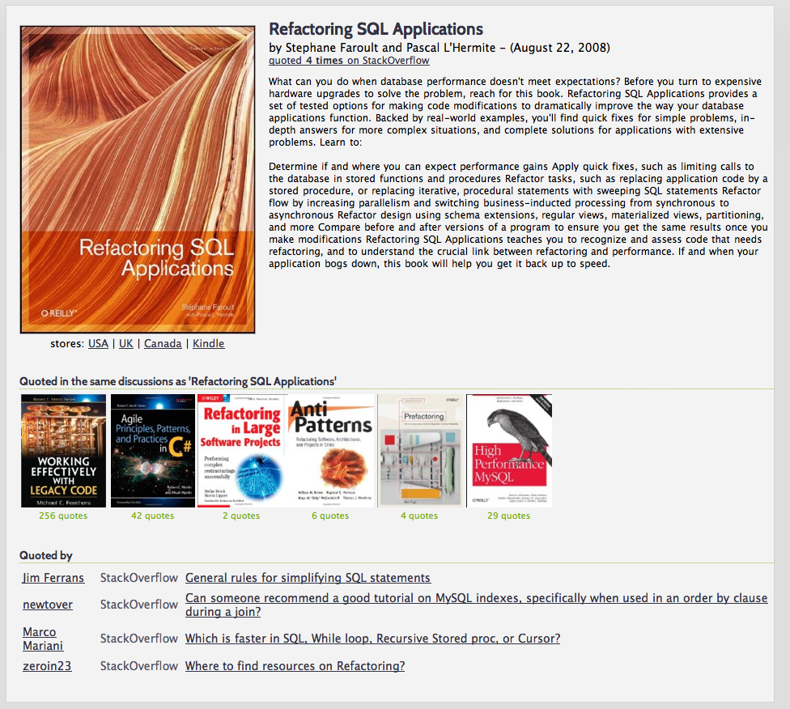
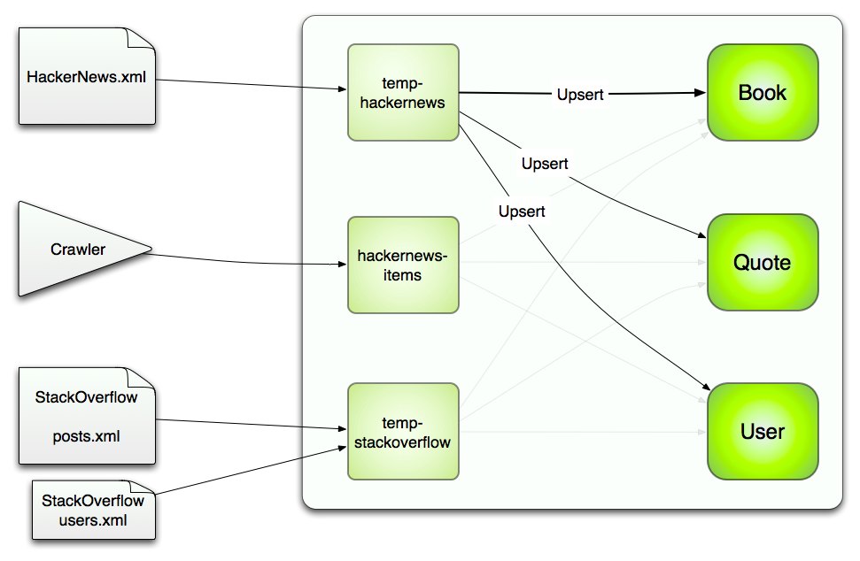
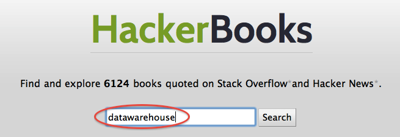
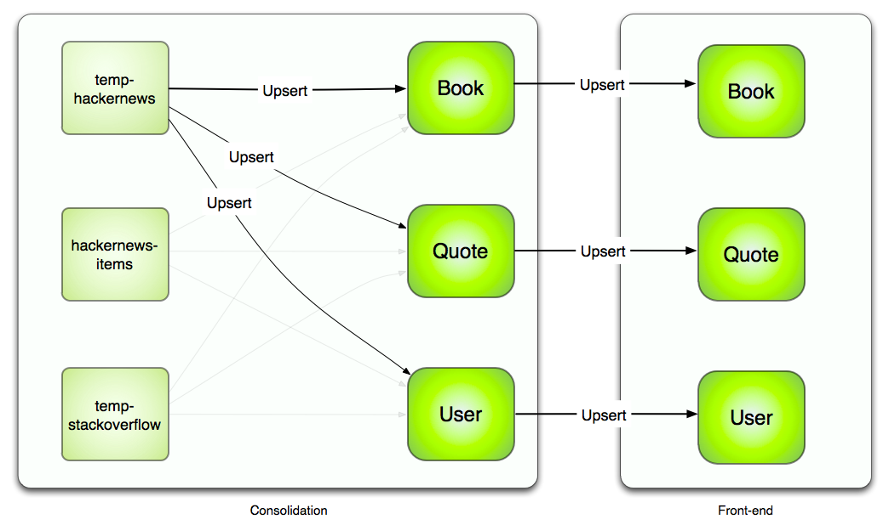

!SLIDE

# MongoDB + Solr
## ETL et indexation full-text

 
 
 
<h3>Retour d'expérience sur HackerBooks.com</h3>
<h3>Thibaut Barrère (Freelance) @ LoGeek.fr</h3>

!SLIDE

# Ze Plan

  <h2 style="text-align: left;">1 - Fonctionnement du site</h2>
  <h2 style="text-align: left;">2 - ETL / MongoDB</h2>
  <h2 style="text-align: left;">3 - Indexation / Solr</h2>
  <h2 style="text-align: left;">4 - Pitfalls</h2>

!SLIDE full-page-image

!SLIDE full-page-image

## Stack Overflow

!SLIDE full-page-image

## Hacker News

!SLIDE full-page-image

!SLIDE full-page-image

!SLIDE

<h1>Extract Transform Load</h1>

  

Image courtesy of [lezarderose](http://www.flickr.com/people/lezarderose)

!SLIDE

# Sources de données brutes

 
## Dump Stack Overflow (3 Gb XML)
 
## Dump Hacker News (1 Gb XML)
## + Crawler Hacker News (updates)

!SLIDE

## I Can Haz Diagram?

!SLIDE

## Extraction/conformation

    @@@ruby
    HackerNews::SaxReader.new(file).each do |record|
      result = {}      
      result['discussion_id'] = record['ParentID']
      result['points'] = record['Points']
      # ...
      
      collection.insert(result)
    end

!SLIDE

## Extraction/conformation (batch)

    @@@ruby
    HackerNews::SaxReader.new(file).each do |record|
      result = {}      
      result['discussion_id'] = record['ParentID']
      result['points'] = record['Points']
      # ...
      
      batch << result
      if batch.size > 1000
        collection.insert(batch, :safe => true)
        batch = []
      end
    end

### => API pratique pour mapping / bulk load / lookup / truncate

!SLIDE

## Recherches/lookups/conversions

### Distinct

    @@@ruby
    User.collection.distinct(:id, { :site => 'SO' })

### Find/lookup

    @@@ruby
    quotes = Quote.find_by_asin('ABND12567X')

### Updates

    @@@ruby
    collection.update(
      { 'type' => '2','discussion_id' => discussion_id },
      { '$set' => { 'discussion_title' => title }},
      { :multi => true })

!SLIDE

## Upsert (update or insert)

    @@@ruby
    Quotes.collection.update(
      quote.slice('asin', 'site', 'id'), # clé composite
      { '$set' => quote },               # nouvelle valeur  
      { :upsert => true }
    )

### => code identique pour:
### - une consolidation complète
### - une consolidation incrémentale sur un jour
### - ou sur un seul élément

!SLIDE smaller_code

## Extraction des liens

    @@@ruby
    R = /http:\/\/rads\.stackoverflow\.com\/amzn\/click\/([\w]+)/
    
    each_row { |row|
      # links, yummy links!
      Nokogiri::HTML(row[:input]['content']).css('a').each do |link|
        href = link.attributes['href'].value

        if href =~ R
          asin = $1
          quote = {
            'asin' => asin,
            'site' => 'SO',
            'id' => row[:input]['id'],
            'discussion_id' => row[:input]['discussion_id'],
            'discussion_title' => row[:input]['discussion_title']
          }
          book = {'asin' => asin}
          user = {'site' => quote['site'],'id' => quote['user_id']}
          # upsert
        end
      end
    end

!SLIDE

## Manipulations de collections par API

    @@@ruby
    tmp_items = db.collection('tmp_items')
    tmp_items.remove # remove all items
    
    # import  (extract/load)
    # screens (data checks)
    
    # publication de la table si validée
    db.collection('old_items').drop
    
    if db.collection_exist?('items')
      db.collection('items').rename('old_items')
    end
    
    db.collection('tmp_items').rename('items')

!SLIDE

### Avantages de MongoDB en ETL
 
 

## 1) Absence de schéma

### Load initial facilité
### Maintenance du load
### Beaucoup de code en moins
### Tests automatisés

!SLIDE

### Avantages de MongoDB en ETL
 
 

## 2) Richesse de requêtage équivalent au SQL

### Lookup par index
### Lookup par clés composites
### Updates multiples

!SLIDE

### Avantages de MongoDB en ETL
 
 

## 3) Upsert

### Même process pour complet ou incrémental
### Built-in / atomique
### Nouvelles features apparaissent

!SLIDE

### Avantages de MongoDB en ETL
 
 

## 4) Manipulation des tables/databases

### Tâche très fréquente: API moderne = yay!

!SLIDE
### Avantages de MongoDB en ETL
 
 

## 5) Scalabilité/sharding/map-reduce

### Non utilisé sur HackerBooks.com
### Mais à creuser

!SLIDE

### Friction lors d'un travail de type ETL

<h1>MongoDB est à SQL</h1>

<h2>ce que Ruby est à Java</h2>

!SLIDE

# Indexation full-text

  

!SLIDE

# Possibilités envisagées

## MongoDB seul
## Sphinx (Pierre Far)
## Solr
 
## ElasticSearch
## MongoDB: #SERVER-380

!SLIDE smaller_code

## Adapteur MongoMatic/Solr (1/2)

    @@@ruby
    class InstanceAdapter < Sunspot::Adapters::InstanceAdapter
      def id
        @instance['_id']
      end
    end

    Sunspot::Adapters::InstanceAdapter.register(InstanceAdapter, Book)

!SLIDE smaller_code

## Adapteur MongoMatic/Solr (2/2)

    @@@ruby
    class DataAccessor < Sunspot::Adapters::DataAccessor
      def load(id)
        @clazz.find_one(BSON::ObjectId(id))
      end

      def load_all(ids)
        ids = ids.map { |_id| BSON::ObjectId(_id) }
        @clazz.find('_id' => { '$in' => ids}).to_a
      end
    end

    Sunspot::Adapters::DataAccessor.register(DataAccessor, Book)

!SLIDE

## Définition des indexes

    @@@ruby
    Sunspot.setup(Book) do

      text :asin, :title, :description, :stored => true

      string :quoted_by, :multiple => true
      string :quoted_on, :multiple => true

      integer :karma
      boolean :kindle_edition

    end

!SLIDE smaller_code

## Accesseurs de données (1/2)

    @@@ruby
    def karma
      Quote.collection.find('asin' => asin).count
    end

### => 27

    @@@ruby
    def kindle_edition
      amazon_versions_xml.get_array('binding').grep(/kindle/i).size > 0
    end

### => true

!SLIDE smaller_code

## Accesseurs de données (2/2)

    @@@ruby
    def quoted_on
      
      values = Quote.collection.find(
        { 'asin' => asin }, 
        { :fields => { 'site' => 1, '_id' => 0 }})
      
      values.map { |e| e['site'] }.uniq.sort
    
    end

### => ['HN', 'SO']

!SLIDE smaller_code

## Indexation

### Batch 'transparent'

    @@@ruby
    preprocess {
      Sunspot.remove_all(Book)
    }

    source(:crawled_books) {
      Book.find_all_crawled
    }

    each_row { |row|
      book = row[:input]
      Sunspot.index(book) if book.valid?
    }

    postprocess {
      Sunspot.commit
    }

### A l'unité

    @@@ruby
    Sunspot.index!(book)

!SLIDE

## Recherche simple

    @@@ruby
    Sunspot.search(Book) do
      keywords 'SQL', :fields => [:title, :description]
      
      order_by :score, :desc
      order_by :karma, :desc
    end

!SLIDE

## Recherche tunée

    @@@ruby
    Sunspot.search(Book) do
      keywords "SQL -Ruby" do
        boost_fields :title => 1.5, :description => 0.1
        boost(function { product(:karma, 3) }) 
      end
      
      with :quoted_on,'HN'
      with :kindle_edition,true
      
      paginate :page => 3, :per_page => 10
    end

!SLIDE

# PitFalls!!!

  

Image (c) Cover Orange / iPad

!SLIDE

# 32-bits: don't

!SLIDE

# Si serveur unique:

## --journal (1.8)
## or
## --repair

!SLIDE full-page-image

## Consolidation <-----/-----> Front-end

!SLIDE

## VPS: IO, disk, RAM...
## Préférer un dédié si possible.

!SLIDE

# Thank You!

## des questions ?

### thibaut.barrere@gmail.com